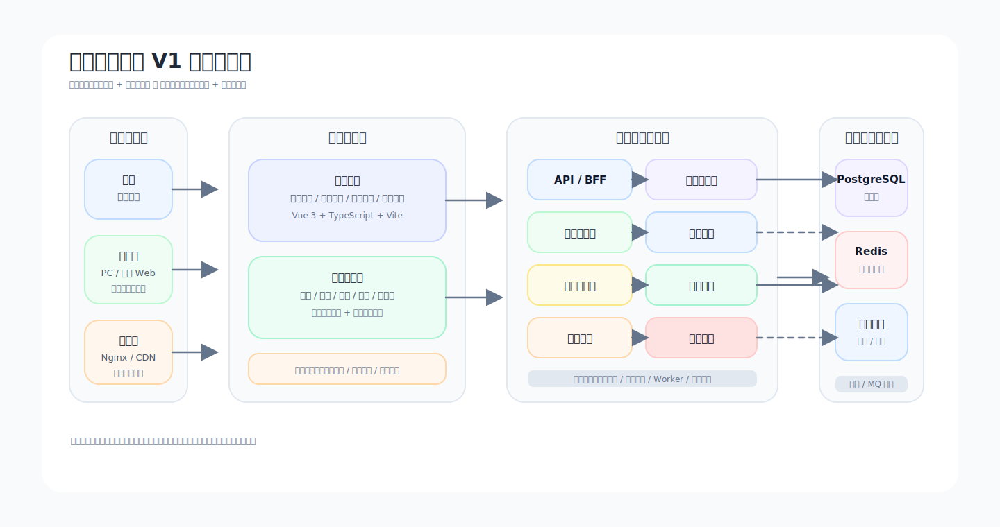
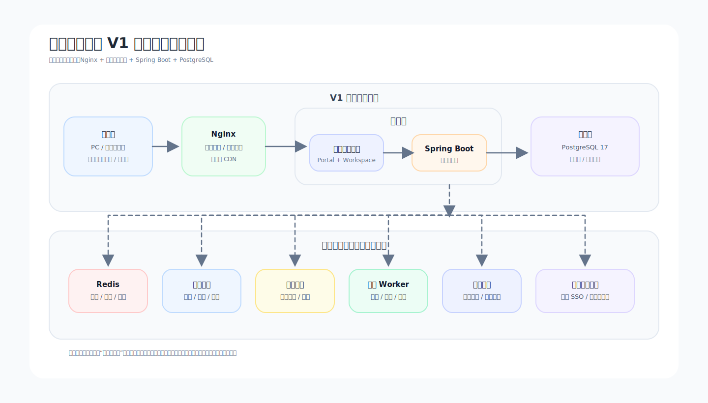

# 前端学习模块 V1 设计草案

**日期：** 2026-04-20

**适用范围：**

- 当前仓库 `vuecraft` 的第一阶段重构
- 产品第一阶段仅聚焦“前端学习模块”
- 后续平台扩展到后端、运维、数据库、架构等学科时，继续复用本设计中的领域边界与信息架构原则

---

## 1. 背景与目标

当前项目已有一个 Vue 3 前端站点基础，但首页方向跑偏，存在明显的加密货币 Landing 风格，与目标产品不一致。现阶段不保留原有页面表达，只保留可复用的技术底座与部分内容组织经验。

本次设计的目标不是做一个单纯的前端知识展示站，而是定义一个可持续演进的学习平台起点：

- 第一阶段先做“前端学习模块”
- 先服务个人用户
- 未来支持团队与企业租户
- 未来扩展到程序员其他学科与运维等方向
- 当前实现保持克制，但领域模型与架构边界一次设计清楚，避免后期推倒重来

---

## 2. 产品定位

### 2.1 平台定位

这是一个面向程序员长期成长的学习平台。它不是纯文档站，不是单课程售卖页，也不是单纯的个人笔记站，而是一个将学习路线、知识库、项目实战和学习记录整合在一起的学习产品。

### 2.2 第一阶段定位

第一阶段产品定位为：

**一个面向有一定基础用户的前端进阶学习平台，通过清晰的学习路线，将用户从“会一点前端”带到“能够独立完成 Vue 与工程化项目”。**

### 2.3 核心目标用户

第一阶段主用户不是纯零基础，也不是资深架构师，而是：

- 已经接触过 HTML、CSS、JavaScript
- 会写一些页面或简单交互
- 想系统提升到 Vue 3、TypeScript、工程化与项目交付能力

### 2.4 不做什么

第一阶段明确不做以下方向：

- 不做全学科大而全平台
- 不做重运营课程平台
- 不做强社区产品
- 不做复杂企业培训系统
- 不做微服务架构验证项目

---

## 3. 产品总体形态

### 3.1 总体形态选择

产品采用 **“门户 + 工作台双层型”** 结构。

原因如下：

- 公开门户适合做价值表达、路线展示、内容浏览与对外传播
- 学习工作台适合承载个人学习闭环、进度、收藏、笔记和项目记录
- 这种结构天然适合未来扩展到团队与企业场景
- 相比纯门户型或纯工作台型，它更符合“先个人、后开放”的目标

### 3.2 双层结构定义

#### 公开门户层

未登录或游客访问时，用户看到的是公开学习门户。主要职责：

- 解释产品是什么
- 展示推荐学习路径
- 展示公开可浏览专题内容
- 展示精选项目实战
- 引导用户进入学习流程

#### 学习工作台层

登录后，用户进入个人学习工作台。主要职责：

- 呈现当前学习阶段与下一步任务
- 展示学习路线进度
- 管理收藏、笔记、项目与回顾清单
- 后续承接团队空间与企业空间切换

---

## 4. 信息架构

### 4.1 一级导航

第一阶段建议一级导航固定为：

- 首页
- 学习路线
- 知识库
- 项目实战
- 我的学习

说明：

- “学习路线”是绝对主入口
- “知识库”服务学习过程，不是独立文章堆场
- “项目实战”服务能力落地，不做泛项目广场
- “我的学习”承接个人闭环

### 4.2 首页结构

首页是公开门户首页，不再使用当前 crypto landing 风格。

首页职责只做四件事：

- 明确说明平台适合谁
- 展示主学习路线
- 告诉用户进入平台后的成长路径
- 用少量精选内容建立信任感

首页建议模块如下：

1. 英雄区
2. 平台价值说明
3. 前端进阶主线概览
4. 推荐专题
5. 精选项目实战
6. 学习方式说明
7. 用户成果或阶段收益说明
8. 登录/开始学习入口

### 4.3 学习路线结构

第一阶段只做一条主路线：**前端进阶主线**

路线按能力递进拆成四段：

1. JS / TS 补强
2. Vue 核心能力
3. 工程化与协作
4. 综合项目落地

每个路线节点应统一包含以下字段：

- 节点目标
- 前置知识
- 核心内容
- 示例代码
- 练习任务
- 检查点
- 小项目或阶段项目
- 关联知识卡片

### 4.4 知识库结构

知识库不是独立于路线之外的大型内容库，而是路线的支持系统。

知识卡片类型建议统一为：

- 概念卡
- API/语法卡
- 常见错误
- 最佳实践
- FAQ
- 术语解释

未来平台扩学科时，知识库结构可复用，不需要重做。

### 4.5 项目实战结构

第一阶段项目实战只做与主路线强绑定的项目，不做海量项目列表。

建议项目类型：

- Vue 组件练习项目
- 状态管理与请求项目
- 工程化配置项目
- 综合进阶项目

每个项目建议统一包含：

- 项目背景
- 目标能力
- 任务拆分
- 验收标准
- 关联路线节点
- 关联知识卡片
- 完成记录

### 4.6 我的学习

第一阶段个人学习区建议只保留：

- 学习进度
- 最近学习
- 收藏
- 笔记
- 已完成项目
- 待复习清单

不在第一阶段引入重社交关系、公开排行榜或复杂互动体系。

---

## 5. 用户与租户策略

### 5.1 当前优先级

当前优先级明确如下：

- 支持个人、团队、企业三种租户形态
- 第一优先级是个人用户
- 第一阶段界面只重点服务个人场景

### 5.2 设计原则

必须明确区分以下概念：

- 用户
- 租户
- 成员关系
- 角色权限

原因：

- 用户不一定只属于一个租户
- 同一个用户在不同租户中可能拥有不同身份
- 租户不一定总是企业，也可能是个人空间或团队空间
- 权限必须依赖“成员关系”而不是直接绑死在用户上

### 5.3 第一阶段产品表现

虽然领域层预留多租户，但第一阶段产品上不直接暴露复杂租户切换。

界面层策略：

- 当前默认只有个人空间
- 未来团队空间与企业空间通过“工作台空间切换”承接
- 导航结构和页面入口现在不做多租户负担

---

## 6. 领域模型设计

### 6.1 核心领域

第一阶段就应定义清楚以下核心领域：

- 租户领域
- 用户领域
- 成员关系领域
- 角色权限领域
- 内容领域
- 学习记录领域
- 项目成果领域
- 安全审计领域

### 6.2 各领域边界

#### 租户领域

负责：

- 租户生命周期
- 租户类型
- 租户配置
- 租户级资源边界

不负责：

- 用户认证细节
- 内容发布逻辑

#### 用户领域

负责：

- 账号身份
- 登录方式
- 基础资料
- 用户状态

不负责：

- 租户权限
- 内容结构

#### 成员关系领域

负责：

- 用户与租户的关系
- 成员身份
- 加入/退出/邀请

#### 角色权限领域

负责：

- 角色定义
- 权限定义
- 资源范围
- 授权关系

#### 内容领域

负责：

- 学科
- 路线
- 阶段
- 知识点
- 项目
- 标签
- 内容版本
- 发布状态

设计要求：

- 内容结构不能只为前端学科服务
- 后续扩展到后端、运维、数据库时应复用同一骨架

#### 学习记录领域

负责：

- 学习进度
- 完成状态
- 收藏
- 笔记
- 最近访问
- 练习结果
- 复习计划

设计要求：

- 学习记录尽量不与内容版本强耦合
- 保证内容更新后历史学习记录仍可解释

#### 项目成果领域

负责：

- 项目提交
- 项目完成状态
- 验收结果
- 项目版本记录

#### 安全审计领域

负责：

- 登录行为
- 授权变更
- 内容发布
- 删除操作
- 导出操作
- 租户切换

---

## 7. 技术架构方案

### 7.1 前端技术路线

前端继续使用现有主技术栈：

- Vue 3
- TypeScript
- Vite
- Pinia
- Vue Router

保留原因：

- 与当前项目兼容
- 适合做内容型 + 工作台型产品
- 工程复杂度可控
- 对后续设计系统与交互增强友好

### 7.2 UI 与样式策略

现有项目虽然使用 Element Plus，但不建议继续让它主导整站视觉。

建议策略：

- 保留 Element Plus 作为后台类基础控件来源
- 首页与学习主界面使用自定义设计系统表达
- 建立统一的 Design Tokens
- 将品牌层、布局层、内容层、交互层分离

### 7.3 后端技术路线

后端建议采用：

- Java 21 LTS
- Spring Boot 3.5.x
- PostgreSQL 17

说明：

- 这是当前阶段最稳、资料最丰富、适合快速迭代又能承接长期演进的组合
- 当前阶段不追求“最新大版本即最优”
- 优先选择可验证、低维护、生态成熟的方案

### 7.4 架构风格

第一阶段采用 **模块化单体**

原因：

- 当前复杂度来自业务演化而不是系统吞吐
- 用户、内容、学习记录、权限、审计强相关
- 提前拆微服务会引入不必要的分布式复杂度
- 模块化单体更适合快速验证产品方向

### 7.5 V1 逻辑架构图

图示说明：

- 当前阶段只有一个前端主应用也可以落地，但产品形态上仍然区分“公开门户”和“学习工作台”两种体验层。
- 后端虽然部署为单体，但领域上已经按认证、租户、内容、学习记录、项目、权限、审计拆清边界。
- Redis、对象存储、搜索索引在第一阶段不是强制依赖，但从架构图上提前预留，后续接入时不需要改产品边界。

### 7.6 V1 部署与演进留白图

图示说明：

- 第一阶段推荐的最小可用部署就是 `Nginx + 前端静态资源 + Spring Boot + PostgreSQL`。
- Redis 不是第一天必须安装，但在会话、缓存、限流、热点查询场景中很快会有价值，因此建议在图中保留。
- 对象存储、消息队列、搜索服务、Worker、企业身份接入全部作为第二阶段以后能力，不提前落地实现，但提前保留接入点。

### 7.7 未来演进预留

虽然当前不做微服务，但应从设计上预留以下能力：

- 领域事件边界
- 异步任务边界
- 读写分离思路
- 统一资源范围模型
- 幂等能力
- 可拆模块调用边界

这意味着：

- 现在不做重型基础设施
- 但后面要拆服务、接搜索、接对象存储、接队列时，不会推翻领域设计

---

## 8. 安全设计

### 8.1 第一阶段必须做

- 登录与会话安全
- 密码安全存储
- 基础 RBAC
- 租户级数据隔离
- 输入校验
- 输出编码
- CSRF / CORS 基线控制
- 高风险操作审计
- 最小权限原则

### 8.2 后续可补充

- MFA
- 企业 SSO
- 更细粒度授权模型
- 风险登录识别
- 安全运营能力

### 8.3 原则

- 安全必须由后端兜底
- 前端隐藏按钮不算安全
- 审计是领域能力，不是附属日志

---

## 9. 视觉与品牌方向

### 9.1 目标气质

整体视觉目标为：

**Apple 式克制 + 轻科技感 + 学习产品的秩序感**

关键词：

- 简洁
- 克制
- 可信
- 高级
- 专注
- 有前沿感但不浮夸

### 9.2 首页视觉策略

首页可以承载适度的前沿前端表达，包括：

- 轻量 Three.js 英雄区表达
- 低密度粒子氛围
- 路径或知识结构可视化
- 细腻滚动联动

但必须坚持：

- 动效服务内容，不服务炫技
- 首页视觉主角是学习路径与成长价值，不是抽象酷炫装置

### 9.3 学习内页视觉策略

学习内页必须回归：

- 高可读
- 高专注
- 高效率

要求：

- 降低背景噪音
- 强化排版和栅格秩序
- 强化代码、练习、进度和反馈区域
- 动效只做轻状态反馈

### 9.4 明确避免的风格

第一阶段明确禁止以下方向：

- 币圈 Landing 风格
- 紫黑霓虹发光主视觉
- 高密度粒子雨
- 大面积玻璃拟态发光卡片
- 高噪音连续滚动特效

---

## 10. 当前项目重构原则

当前 `vuecraft` 项目可以整体推翻原有页面表达，但建议保留以下价值：

- Vue 3 + TS + Vite 工程底座
- 现有内容组织思路中的“模块化”经验
- 可复用的部分公共工程配置

建议推翻或重做以下部分：

- `/` 首页 Landing
- 现有偏 crypto 的视觉叙事
- 让 Element Plus 直接决定整站视觉的方式
- 当前混乱的中文编码内容

---

## 11. 第一阶段交付边界

第一阶段不要求完成完整平台，而要求完成一个方向正确的产品起点。

第一阶段建议交付范围：

- 新的公开门户首页
- 前端学习主路线
- 基础知识卡片体系
- 关联项目实战入口
- 个人学习工作台基础版
- 基础账号系统
- 基础学习记录能力

不在第一阶段强行交付：

- 多租户完整产品能力
- 团队协作能力
- 企业管理后台
- 完整社区系统
- 重推荐系统
- 重运营系统

---

## 12. 后续产出物

基于本设计，下一步应继续输出三类文档：

1. V1 页面地图
2. 数据库草模
3. 技术实施方案

只有在这些文档明确后，再进入正式开发阶段，才能避免“边做边改方向”。

---

## 13. 本设计的最终结论

本项目第一阶段的最优解不是做一个炫酷但空心的前端展示站，也不是做一个一开始就背着未来复杂度前进的大平台，而是：

**以“门户 + 工作台双层型”为产品外壳，以“学习路线”为主线，以“知识库 + 项目实战”为补充，以“模块化单体 + 多租户留白”为技术与领域策略，先做一个真正服务个人成长、又足够支撑未来扩展的前端学习平台起点。**
